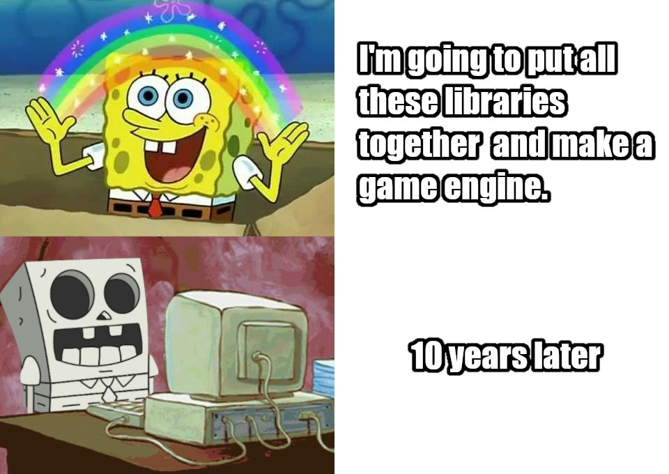

+++
title = "Game engines are more than libraries glued together"
description = "The value of vision and the cost of external dependencies"
date = 2022-07-22
author = "Alice I. Cecile"
draft = true

[taxonomies]
tags = ["bevy", "open source"]
+++

Meme from the [Twitter post](https://twitter.com/reduzio/status/1550462229484560385) by Juan Linietsky, creator of [Godot], that inspired this blog post.

When envisioning a massive, challenging technical project (such as, in our case, a [game engine](https://bevyengine.org/)),
the natural path of least resistance is to take a bunch of working components, glue them all together and then ship it!
What could be easier?

Unfortunately, it seems, empirically, that this doesn't work.
It's not a path to success:
GitHub is littered with failed projects taking this approach
while the most promising up-and-coming game engines ([Godot], [Bevy], [Our Machinery])
eschew this in favor of a much more integrated design.

Why?
The underlying libraries (like [SDL2]or [OpenGL]) can all be great, high quality pieces of software.
The engines that develop momentum often rely on these same foundational libraries
(in Bevy's case, [wgpu] and [winit] are the big ones)
that get glued together,
and individual game projects (like [Stellaris](https://www.paradoxinteractive.com/games/stellaris/about)) can succeed
by doing precisely the thing I'm arguing you shouldn't do!

So what's the difference?
What *is* a game engine,
and why can't we make one by slapping high-quality libraries together in a sticky, gluey blob?

[Godot]: https://godotengine.org/
[Bevy]: htttps://bevyengine.org/
[Our Machinery]: https://ourmachinery.com/
[SDL2]: https://www.libsdl.org/
[OpenGL]: https://www.opengl.org/
[wgpu]: https://github.com/gfx-rs/wgpu
[winit]: https://github.com/rust-windowing/winit
[Stellaris]: https://www.paradoxinteractive.com/games/stellaris/about
